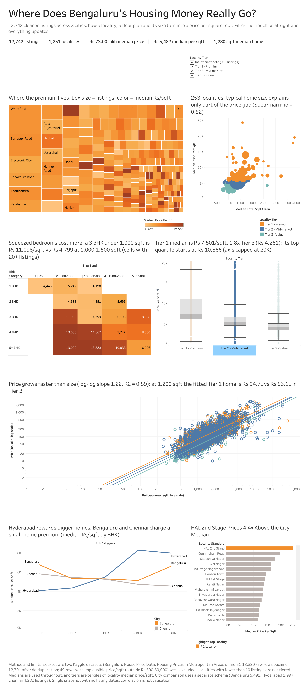

# Bengaluru / Hyderabad Housing Market Analysis

A project that takes messy, real housing listing data and turns it into a clean dataset, a set of findings, and a Tableau dashboard. Every number here comes from the real data - nothing is guessed or made up (see `docs/methodology.md` for how each step works).

## What this is

Bengaluru's housing listings are messy. The same area is spelled a dozen different ways, floor sizes are recorded in five or more different units, and there's no simple way to tell if a price is actually high or low for its area. This project cleans that up properly and uses the clean data to answer real questions: which areas are expensive, how price changes with size and BHK, and which listings look mispriced compared to similar homes nearby.

## What I did

1. Checked the raw data for problems first, before changing anything.
2. Cleaned it without deleting rows - every row keeps a flag saying whether it's Valid, Suspicious, or Invalid, so nothing is silently thrown away.
3. Split areas into price tiers based on actual prices, not guesswork.
4. Answered the main business questions by comparing each listing to *similar* listings (same size, same BHK, same tier) instead of just comparing raw prices across very different homes.
5. Wrote the cleaning step twice - once in Python, once in plain SQL - and checked that both give the same result.
6. Built a 5-dashboard Tableau workbook from the cleaned data.

## The data

- [Bengaluru House Price Data](https://www.kaggle.com/datasets/amitabhajoy/bengaluru-house-price-data) (Kaggle) - 13,320 real listings, the main dataset
- [Housing Prices in Metropolitan Areas of India](https://www.kaggle.com/datasets/ruchi798/housing-prices-in-metropolitan-areas-of-india) (Kaggle) - Hyderabad and Chennai, used only to compare across cities

See `data/README.md` for exact download steps.

## Tools used

Python (pandas, NumPy, SciPy, rapidfuzz), SQL, Databricks + Delta Lake (optional path), Tableau, matplotlib/seaborn.

## Cleaning the data

The raw file has real problems, not textbook ones:

- **Floor size** (`total_sqft`) comes as plain numbers, ranges like `"1000 - 1200"`, and units like Sq. Meter, Sq. Yards, Acres, Cents, Guntha, Grounds, and Perch. All of these get converted to one plain sqft number, with the method used recorded per row.
- **Area names** have 1,294 raw spellings for far fewer real places. Spelling and punctuation differences are merged automatically - `"White Field"` and `"Whitefield"` become one area. Look-alike names that *might* just be typos, like `"HBR Layout"` vs `"HSR Layout"`, are **not** merged automatically - a script can't safely tell a typo from two genuinely different places (both score the same on a similarity test). Those 139 candidates are written to a report for a human to check instead of being guessed at.
- **Nothing is deleted.** Every row keeps a `quality_flag` - Valid, Suspicious, or Invalid - and later analysis decides what to include.

This cleaning step is written twice, on purpose: once in Python (`notebooks/02_data_cleaning.py`) and once in plain SQL (`sql/00_data_cleaning.sql`). I ran both against the same raw file and checked the outputs match - same row count, same quality-flag counts, same BHK and size-bucket counts, same totals. The one small difference: in about 8 of the 1,257 areas, the two pick a different capitalization for the display name when two spellings occur equally often (a tie-break difference, not a different grouping - it doesn't change any number).

## What I found

- **HAL 2nd Stage** is the most expensive area by a wide margin - Rs 24,167 per sqft (based on 11 listings), about 4.4x the city's median of Rs 5,482.
- Price jumps sharply at 4 BHK. Oddly, 5+ BHK homes cost *more* per sqft but *less* in total than 4 BHK homes - so it's not a simple "more rooms = more expensive" pattern.
- Comparing each listing only to similar homes nearby (same BHK, size, and tier) flags **Chandapura** as priced about 41% below its true peers - a specific, checkable lead, not a blanket "cheap area" claim.
- About 1 in 10 listings (1,191 of 12,742 valid ones) look like statistical outliers on price per sqft. A separate check against similar homes flags 513 as possibly under-priced and 850 as possibly over-priced.

Full write-up, with the reasoning behind each number: [`reports/insight_memo.pdf`](reports/insight_memo.pdf).

## The dashboard



`dashboard/tableau/housing_market_dashboard.twb` has 5 dashboards. Four are simple, focused views: market overview, locality info, BHK/property breakdown, and value & outliers. The fifth, **"5 - Market Story,"** is one long page that walks through the whole story in order - a KPI summary, a treemap, a bubble chart, a heat map, a box plot, a scatter plot with trend lines, a three-city comparison chart, and a bar chart of the top 15 areas. One filter on that page (Locality Tier) controls every chart on it, not just one.

The workbook isn't published to Tableau Public yet - open `housing_market_dashboard.twb` directly in Tableau Desktop (the free Public Desktop app works) to explore it, or use the screenshot above. Static versions of the individual charts, made with Python, are in `dashboard/screenshots/`.

## How to run this yourself

```bash
python3 -m venv .venv && source .venv/bin/activate
pip install pandas numpy matplotlib seaborn scipy rapidfuzz pyarrow reportlab duckdb

python notebooks/01_data_profiling.py        # -> reports/data_quality_report.md
python notebooks/02_data_cleaning.py         # -> data/cleaned/*_clean.{csv,parquet}
python notebooks/03_feature_engineering.py   # -> data/cleaned/housing_cleaned.*, locality tiers
python notebooks/04_statistical_analysis.py  # -> reports/analysis_results.json
python notebooks/05_visualizations.py        # -> dashboard/screenshots/*.png
python notebooks/06_generate_insight_memo.py # -> reports/insight_memo.{md,pdf}
python notebooks/07_city_comparison.py       # -> dashboard/tableau/city_comparison.csv
```

To run the SQL version of the cleaning step and see it match the Python one:

```bash
python3 -c "import duckdb; print(duckdb.connect().execute(open('sql/00_data_cleaning.sql').read()).fetchdf())"
```

For the Databricks/Delta/Tableau path, see `notebooks/databricks_etl_notebook.py` and `dashboard/tableau/TABLEAU_SETUP.md`.

## Repository layout

```
housing-market-analytics/
├── README.md
├── data/
│   ├── README.md
│   ├── raw/                 (as downloaded from Kaggle)
│   └── cleaned/             (pipeline output, .csv + .parquet)
├── notebooks/
│   ├── 01_data_profiling.py
│   ├── 02_data_cleaning.py
│   ├── 03_feature_engineering.py
│   ├── 04_statistical_analysis.py
│   ├── 05_visualizations.py
│   ├── 06_generate_insight_memo.py
│   ├── 07_city_comparison.py
│   └── databricks_etl_notebook.py   (PySpark/Delta port for Databricks CE)
├── sql/
│   ├── 00_data_cleaning.sql         (cleaning step in plain SQL, checked against the Python one)
│   ├── 01_data_quality.sql
│   ├── 02_locality_analysis.sql
│   ├── 03_bhk_analysis.sql
│   ├── 04_outlier_analysis.sql
│   └── 05_value_analysis.sql
├── dashboard/
│   ├── tableau/              (the .twb workbook + setup notes)
│   └── screenshots/          (dashboard screenshot + static chart previews)
├── reports/
│   ├── data_quality_report.md
│   ├── locality_mapping_bengaluru.csv
│   ├── locality_tier_table.csv
│   ├── analysis_results.json
│   └── insight_memo.{md,pdf}
└── docs/
    ├── methodology.md
    └── data_dictionary.md
```
